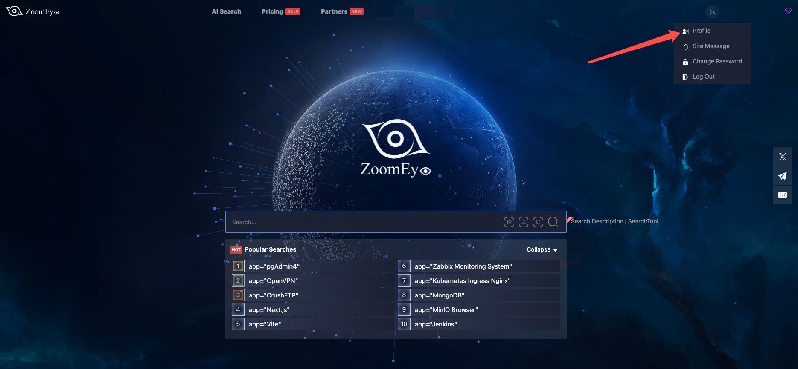
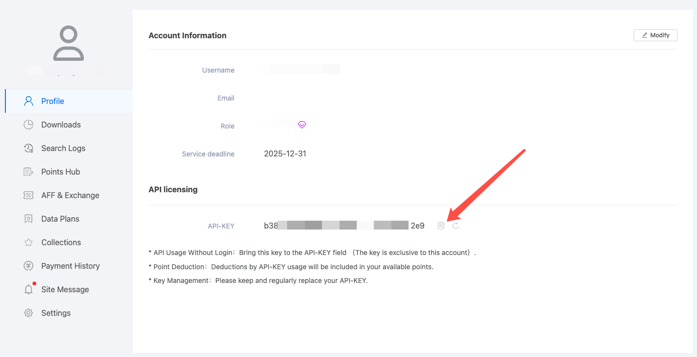
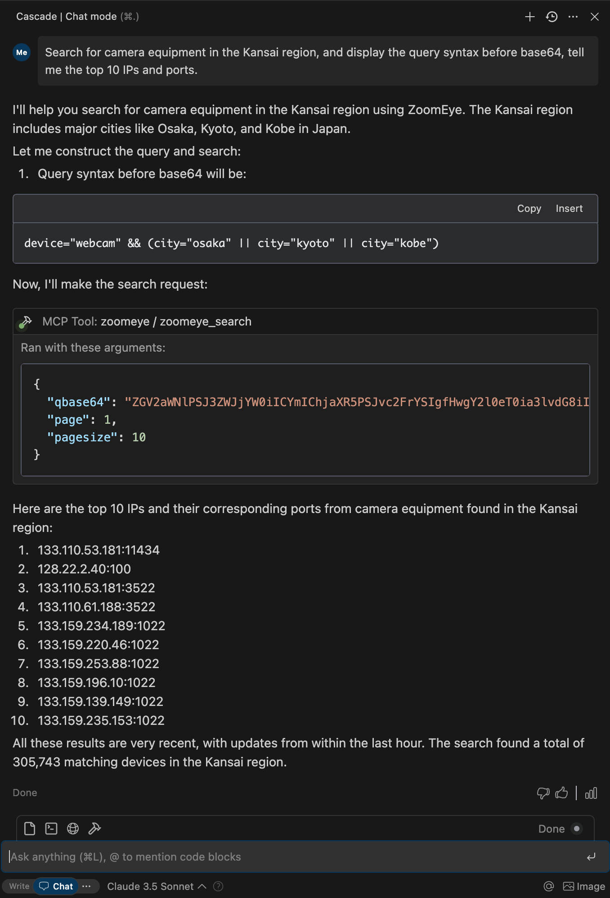

# 🚀 ZoomEye MCP Server

A Model Context Protocol (MCP) server that provides network asset information based on query conditions. This server allows Large Language Models (LLMs) to obtain network asset information by querying ZoomEye using dorks and other search parameters.

## 🔔 Announcement

🎉 We are excited to announce the official open-source release of **ZoomEye MCP Server** — a powerful Model Context Protocol (MCP) server that brings real-time cyber asset intelligence to AI assistants and development environments.

🚀 Free Trial: 7-Day FREE Access to ZoomEye MCP!
Experience ZoomEye MCP — the AI-powered cyberspace asset search engine — absolutely free for 7 days!

🔍 Search global internet assets, track real-time changes, and unlock AI-driven insights — all in one place.

👉 How to claim:

1. Follow us on Twitter: [@zoomeye_team](https://x.com/zoomeye_team)
2. DM us "MCP" and your MCP setup screenshot
3. Get instant access to your 7-day membership

🎁 Limited-time free trial — explore the power of AI asset search today!

💡 Provide insightful feedback that gets officially adopted, and you'll unlock **even more rewards**!

🔧 Fully compatible with leading MCP environments:

- Claude Desktop
- Cursor
- Windsurf
- Cline
- Continue
- Zed
- Cherry Studio
- Chatbox

🔗 Explore ZoomEye MCP Server on:

- GitHub: [zoomeye-ai/mcp_zoomeye](https://github.com/zoomeye-ai/mcp_zoomeye)
- MCP.so: [mcp.so/server/mcp_zoomeye](https://mcp.so/server/mcp_zoomeye/zoomeye-ai)
- Smithery: [smithery.ai/server/@zoomeye-ai/mcp_zoomeye](https://smithery.ai/server/@zoomeye-ai/mcp_zoomeye)
- Cursor Directory: [cursor.directory/mcp/zoomeye](https://cursor.directory/mcp/zoomeye)
- Pulse MCP: [pulsemcp.com/servers/zoomeye](https://www.pulsemcp.com/servers/zoomeye)
- Glama MCP: [glama.ai/mcp/servers](https://glama.ai/mcp/servers)

We welcome everyone to use, explore, and contribute!

## 🔑 How can I get a ZoomEye API key?

To use this MCP server, you’ll need a ZoomEye API key.

1. Go to https://www.zoomeye.ai
2. Register or log in
3. Click your avatar → **Profile**
4. Copy your **API-KEY**
5. Set the environment variable:
   
   `export ZOOMEYE_API_KEY="your_api_key_here"`





## Features

- Query ZoomEye for network asset information using dorks
- Caching mechanism to improve performance and reduce API calls
- Automatic retry mechanism for failed API requests
- Comprehensive error handling and logging

## Available Tools

- `zoomeye_search` - Get network asset information based on query conditions.
  - Required parameters:
    - `qbase64` (string): Base64 encoded query string for ZoomEye search
  - Optional parameters:
    - `page` (integer): View asset page number, default is 1
    - `pagesize` (integer): Number of records per page, default is 10, maximum is 1000
    - `fields` (string): The fields to return, separated by commas
    - `sub_type` (string): Data type, supports v4, v6, and web. Default is v4
    - `facets` (string): Statistical items, separated by commas if there are multiple
    - `ignore_cache` (boolean): Whether to ignore the cache

## Usage Guide

### Basic Usage

Once the server is running, you can interact with it through your AI assistant or development environment. Here's how to use it:

1. **Start the server** using one of the installation methods above
2. **Configure your AI assistant** (Claude Desktop, Cursor, Windsurf, Cline, Continue, Zed, etc.) to use the server
3. **Query network information** using natural language



### Search Syntax Guide

- Search Scope covers devices (IPv4, IPv6) and websites (domains).
- When entering a search string, the system will match keywords in "global" mode, including content from various
  protocols such as HTTP, SSH, FTP, etc. (e.g., HTTP/HTTPS protocol headers, body, SSL, title, and other protocol
  banners).
- Search strings are case-insensitive and will be segmented for matching (the search results page provides a "
  segmentation" test feature). When using == for search, it enforces exact case-sensitive matching with strict syntax.
- Please use quotes for search strings (e.g., "Cisco System" or 'Cisco System'). If the search string contains quotes,
  use the escape character, e.g.,"a\"b". If the search string contains parentheses, use the escape character, e.g.,
  portinfo\(\).

You can see more detailed search syntax rules in [prompts.py](./src/mcp_server_zoomeye/prompts.py).

For more information on the ZoomEye Search API, refer to the [ZoomEye API v2 documentation](https://www.zoomeye.ai/doc).

## Getting Started

### Prerequisites

1. **ZoomEye API Key**
   
   - Register for an account at [ZoomEye](https://www.zoomeye.ai/)
   - Obtain your API key from your account settings
   - The API key will be used to authenticate your requests to the ZoomEye API
2. **Python Environment**
   
   - Python 3.10 or higher is required
   - Alternatively, you can use Docker to run the server without installing Python

## Installation

### Using PIP

Alternatively, you can install `mcp-server-zoomeye` via pip:

```bash
pip install mcp-server-zoomeye
```

After installation, you can run it as a script using the following command:

```bash
python -m mcp_server_zoomeye
```

### Using Docker

You can also run the ZoomEye MCP server using Docker:

#### Pull from Docker Hub

```bash
# Pull the latest image
docker pull zoomeyeteam/mcp-server-zoomeye:latest

# Run the container with your API key
docker run -i --rm -e ZOOMEYE_API_KEY=your_api_key_here zoomeyeteam/mcp-server-zoomeye:latest
```

> **Note**: We provide multi-architecture Docker images that support `linux/amd64` and `linux/arm64` platforms and can run on Intel/AMD and ARM (such as Apple Silicon) processors.

#### Build from Source

Alternatively, you can build the Docker image from source:

```bash
# Clone the repository
git clone https://github.com/zoomeye-ai/mcp_zoomeye.git
cd mcp_zoomeye

# Build the Docker image
docker build -t zoomeyeteam/mcp-server-zoomeye:local .

# Run the container
docker run -i --rm -e ZOOMEYE_API_KEY=your_api_key_here zoomeyeteam/mcp-server-zoomeye:local
```

### Using uv

[`uv`](https://docs.astral.sh/uv/) is a fast Python package installer and resolver written in Rust. It's a modern alternative to pip that offers significant performance improvements.

#### Installation of uv

```bash
# Install uv using curl (macOS/Linux)
curl -LsSf https://astral.sh/uv/install.sh | sh

# Or using PowerShell (Windows)
irm https://astral.sh/uv/install.ps1 | iex

# Or using Homebrew (macOS)
brew install uv
```

#### Using uvx to run mcp-server-zoomeye

No specific installation is required when using [`uvx`](https://docs.astral.sh/uv/guides/tools/), which allows you to run Python packages directly:

#### Installing with uv

Alternatively, you can install the package using uv:

```bash
# Install in the current environment
uv pip install mcp-server-zoomeye

# Or create and install in a new virtual environment
uv venv
uv pip install mcp-server-zoomeye
```

## Configuration

### Environment Variables

The ZoomEye MCP server requires the following environment variable:

- `ZOOMEYE_API_KEY`: Your ZoomEye API key for authentication

You can set this environment variable in several ways:

1. **Export in your shell session**:
   
   ```bash
   export ZOOMEYE_API_KEY="your_api_key_here"
   ```
2. **Pass directly when running the container** (for Docker):
   
   ```bash
   docker run -i --rm -e ZOOMEYE_API_KEY=your_api_key_here zoomeyeteam/mcp-server-zoomeye:latest
   ```

### Configure Claude.app

Add the following in Claude settings:

<details>
<summary>Using uvx</summary>

```json
"mcpServers": {
  "zoomeye": {
    "command": "uvx",
    "args": ["mcp-server-zoomeye"],
    "env": {
        "ZOOMEYE_API_KEY": "your_api_key_here"
    }
  }
}
```

</details>

<details>
<summary>Using docker</summary>

```json
"mcpServers": {
  "zoomeye": {
    "command": "docker",
    "args": ["run", "-i", "--rm", "-e", "ZOOMEYE_API_KEY=your_api_key_here", "zoomeyeteam/mcp-server-zoomeye:latest"],
    "env": {
      "ZOOMEYE_API_KEY": "your_api_key_here"
    }
  }
}
```

</details>

<details>
<summary>Installed via pip</summary>

```json
"mcpServers": {
  "zoomeye": {
    "command": "python",
    "args": ["-m", "mcp_server_zoomeye"],
    "env": {
        "ZOOMEYE_API_KEY": "your_api_key_here"
    }
  }
}
```

</details>

### Configure Zed

Add the following in Zed's settings.json:

<details>
<summary>Using uvx</summary>

```json
"context_servers": [
  "mcp-server-zoomeye": {
    "command": "uvx",
    "args": ["mcp-server-zoomeye"],
    "env": {
        "ZOOMEYE_API_KEY": "your_api_key_here"
    }
  }
],
```

</details>

<details>
<summary>Installed via pip</summary>

```json
"context_servers": {
  "mcp-server-zoomeye": {
    "command": "python",
    "args": ["-m", "mcp_server_zoomeye"],
    "env": {
        "ZOOMEYE_API_KEY": "your_api_key_here"
    }
  }
},
```

</details>

## Example Interactions

### Example 1: Retrieve global Apache Tomcat assets

```json
{
  "name": "zoomeye_search",
  "arguments": {
    "qbase64": "app=\"Apache Tomcat\""
  }
}
```

Response:

```json
{
  "code": 60000,
  "message": "success",
  "total": 163139107,
  "query": "app=\"Apache Tomcat\"",
  "data": [
    {
      "url": "https://1.1.1.1:443",
      "ssl.jarm": "29d29d15d29d29d00029d29d29d29dea0f89a2e5fb09e4d8e099befed92cfa",
      "ssl.ja3s": "45094d08156d110d8ee97b204143db14",
      "iconhash_md5": "f3418a443e7d841097c714d69ec4bcb8",
      "robots_md5": "0b5ce08db7fb8fffe4e14d05588d49d9",
      "security_md5": "0b5ce08db7fb8fffe4e14d05588d49d9",
      "ip": "1.1.1.1",
      "domain": "www.google.com",
      "hostname": "SPACEX",
      "os": "windows",
      "port": 443,
      "service": "https",
      "title": ["GoogleGoogle appsGoogle Search"],
      "version": "1.1.0",
      "device": "webcam",
      "rdns": "c01031-001.cust.wallcloud.ch",
      "product": "OpenSSD",
      "header": "HTTP/1.1 302 Found Location: https://www.google.com/?gws_rd=ssl Cache-Control: private...",
      "header_hash": "27f9973fe57298c3b63919259877a84d",
      "body": "HTTP/1.1 302 Found Location: https://www.google.com/?gws_rd=ssl Cache-Control: private...",
      "body_hash": "84a18166fde3ee7e7c974b8d1e7e21b4",
      "banner": "SSH-2.0-OpenSSH_7.6p1 Ubuntu-4ubuntu0.3",
      "update_time": "2024-07-03T14:34:10",
      "header.server.name": "nginx",
      "header.server.version": "1.8.1",
      "continent.name": "Europe",
      "country.name": "Germany",
      "province.name": "Hesse",
      "city.name": "Frankfurt",
      "lon": "118.753262",
      "lat": "32.064838",
      "isp.name": "aviel.ru",
      "organization.name": "SERVISFIRST BANK",
      "zipcode": "210003",
      "idc": 0,
      "honeypot": 0,
      "asn": 4837,
      "protocol": "tcp",
      "ssl": "SSL Certificate Version: TLS 1.2 CipherSuit: TLS_ECDHE_RSA_WITH_AES_128_GCM_SHA256...",
      "primary_industry": "Finance",
      "sub_industry": "bank",
      "rank": 60
    }
  ]
}
```

## Debugging and Troubleshooting

### Using MCP Inspector

The Model Context Protocol Inspector is a tool that helps debug MCP servers by simulating client interactions. You can use it to test your ZoomEye MCP server:

```bash
# For uvx installation
npx @modelcontextprotocol/inspector uvx mcp-server-zoomeye

# If developing locally
cd path/to/servers/src/mcp_server_zoomeye
npx @modelcontextprotocol/inspector uv run mcp-server-zoomeye
```

### Common Issues

1. **Authentication Errors**
   
   - Ensure your ZoomEye API key is correct and properly set as an environment variable
   - Check that your API key has not expired or been revoked
2. **Connection Issues**
   
   - Verify your internet connection
   - Check if the ZoomEye API is experiencing downtime
3. **No Results**
   
   - Your query might be too specific or contain syntax errors
   - Try simplifying your query or using different search terms
4. **Rate Limiting**
   
   - ZoomEye API has rate limits based on your account type
   - Space out your requests or upgrade your account for higher limits

## Advanced Usage

### Caching

The ZoomEye MCP server implements caching to improve performance and reduce API calls:

- Responses are cached based on the query parameters
- Cache duration is configurable (default: 1 hour)
- You can bypass the cache by setting `ignore_cache` to `true` in your query

### Custom Fields

You can request specific fields in your query results by using the `fields` parameter:

```json
{
  "name": "zoomeye_search",
  "arguments": {
    "qbase64": "app=\"Apache\"",
    "fields": "ip,port,domain,service,os,country,city"
  }
}
```

### Pagination

For queries that return many results, you can paginate through them:

```json
{
  "name": "zoomeye_search",
  "arguments": {
    "qbase64": "app=\"Apache\"",
    "page": 2,
    "pagesize": 20
  }
}
```

## Contributing

We encourage contributions to mcp-server-zoomeye to help expand and improve its functionality. Whether it's adding new related tools, enhancing existing features, or improving documentation, your input is valuable.

For examples of other MCP servers and implementation patterns, see:
https://github.com/modelcontextprotocol/servers

Pull requests are welcome! Feel free to contribute new ideas, bug fixes, or enhancements to make mcp-server-zoomeye more robust and practical.

## License

mcp-server-zoomeye is licensed under the MIT License. This means you are free to use, modify, and distribute the software, subject to the terms and conditions of the MIT License. For more information, see the LICENSE file in the project repository.